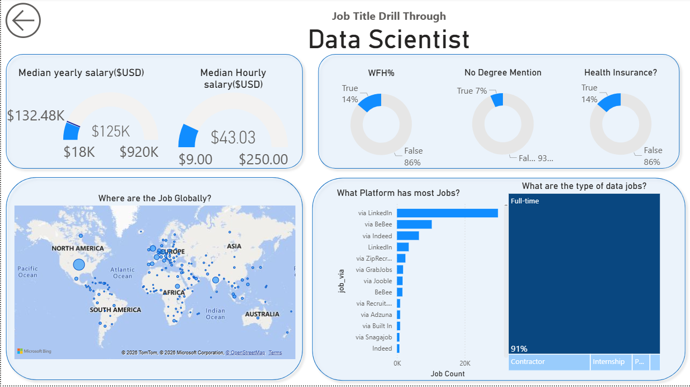

# 📊 Data Jobs Dashboard (Power BI Project)

An interactive **Power BI analytics dashboard** built to explore global trends in **Data Analyst, Data Scientist, and Data Engineer job markets**. This project transforms raw job posting datasets into meaningful business insights using ETL pipelines, KPI tracking, and interactive visual storytelling.

---

# 🚀 Live Dashboard Overview

This dashboard helps users understand:

- Global distribution of data jobs 🌍
- Median salary trends 💰
- Monthly hiring trends 📈
- Role-wise job availability 👩‍💻
- Platform-wise hiring distribution 🧭
- Work-from-home availability 🏠
- Internship vs Full-time opportunities 📊

---

# 🖼️ Dashboard Preview

## Page 1: Data Jobs Market Overview



This page provides a **high-level snapshot of the global data job ecosystem**, including:

- Total job postings (479K)
- Median yearly salary ($113K)
- Median hourly salary ($47.62)
- Monthly hiring trend analysis
- Role-wise job distribution
- Salary comparison across job roles

---

## Page 2: Job Title Drill-Through Analysis (Data Scientist)


This page enables **deep role-level insights**, including:

- Median salary insights specific to Data Scientist roles
- Work-from-home availability statistics
- Degree requirement trends
- Global job location distribution
- Hiring platform comparison (LinkedIn, Indeed, etc.)
- Job type breakdown (Full-time vs Internship vs Contract)

---

# 🧠 Skills Demonstrated

### 📊 Data Analysis

- Exploratory Data Analysis (EDA)
- Trend analysis
- KPI monitoring
- Salary distribution analysis

### ⚙️ Data Engineering Concepts

- ETL pipeline creation using Power Query
- Data cleaning & transformation
- Schema understanding for analytics reporting

### 📈 Visualization

Built using Power BI visual components:

- Cards
- Bar charts
- Line charts
- Scatter plots
- Map visualizations
- KPI indicators
- Drill-through navigation

### 🎯 Dashboard Features

- Interactive slicers for filtering job titles
- Drill-through analytics for role-level exploration
- Dynamic salary comparison visuals
- Global job heatmap visualization
- Platform-wise hiring insights

---

# 📂 Project Structure

```
Data-Jobs-Dashboard/
│
├── Data_Jobs_Dashboard.pbix
├── dataset/
├── images/
│   ├── dashboard_overview.png
│   └── dashboard_drillthrough.png
└── README.md
```

---

# 🛠️ Tools & Technologies Used

- Power BI
- Power Query (ETL)
- DAX Measures
- Excel / CSV dataset

---

# 📌 Key Insights Extracted

Some major insights from the dashboard:

- Data Engineer roles have the highest job availability
- Median yearly salary across data roles ≈ **$113K**
- Majority of jobs are **Full-time (~91%)**
- LinkedIn is the top hiring platform
- North America dominates global hiring demand

---

# 🎯 Project Objective

The objective of this project is to:

- Help students understand market demand for data roles
- Support career planning using real hiring trends
- Demonstrate Power BI analytics capabilities
- Showcase dashboard storytelling skills for recruiters

---

# 👨‍💻 Author

**Dhirendra Sahani**  
B.Tech – Electronics & Instrumentation Engineering  
National Institute of Technology Agartala

---

# ⭐ If you like this project

Give this repository a **star ⭐ on GitHub** and feel free to fork it!